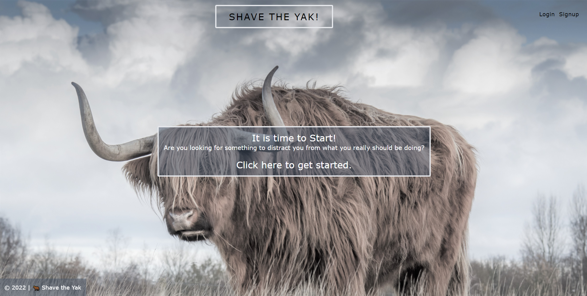

# shave-the-yak

## Description
What is yak shaving? The act of completing a seemingly small task that has no obvious relationship to your intended task, but which is actually linked to that main aim through a chain of other activities.

This project represents the entire collective effort and accumulation of completed _small_ tasks that, at the time, didn't always appear to be directly useful, but have collaboratively come together to amount to a plethora of knowledge in computer programming. The application itself is a quiz that touches on the variety of topics covered throughout an extensive six-month coding bootcamp.

_App Sample Screenshot_

## Motivation
While using the knowledge we've learned to create the application itself, we wanted to make a coding quiz that would also test various aspects of that knowledge as a final farewell and recap to the bootcamp.

## User Story
* AS A bootcamp graduate
* I WANT a quiz that covers all the topics from the bootcamp
* SO THAT I can test myself on the knowledge I’ve learned

## Technologies Used

* Node.js
* Express.js
* Apollo
* React
* GraphQL
* MongoDB
* Mongoose
* MongoDB Atlas
* JSONWebToken
* Heroku
* bcrypt

## Contributors

* [@ashleyviola](https://github.com/ashleyviola): server
* [@erin-michon](https://github.com/erin-michon): quiz and site logic
* [@Jrophoff](https://github.com/Jrophoff): styling
* [@LSabin23](https://github.com/LSabin23): database and quiz questions

## Access

Check out the live site [here](https://evening-reef-89907.herokuapp.com/).

## Future Enhancements Roadmap

* allow users to submit new questions
* randomize questions for each level
* allow users to start with any of the 3 levels
* show a “Today’s Highscores” leaderboard

###### Disclaimer: No yaks were actually shaved in the making of this project. That would be a waste of time...or would it?
